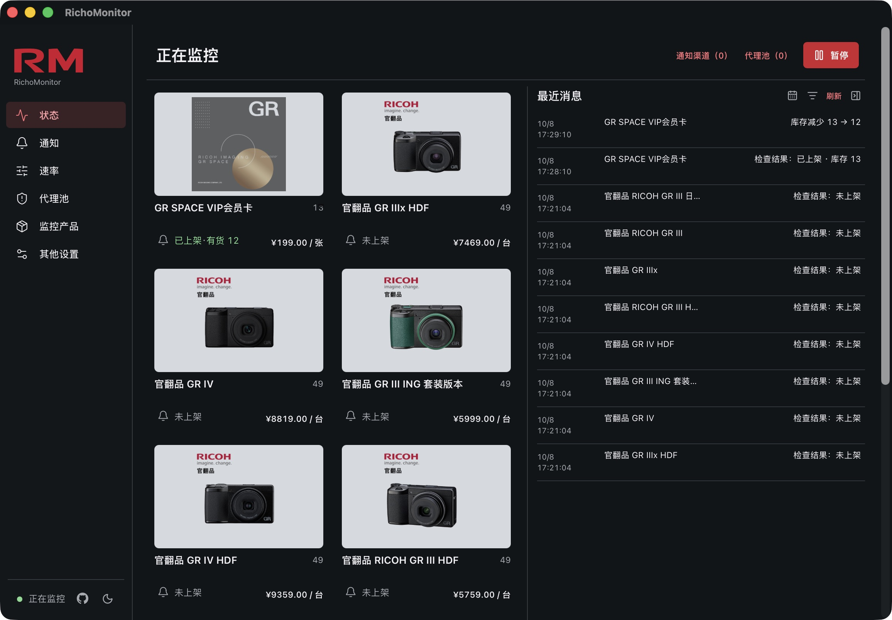

<div align="center">

# RichoMonitor

**让人人都有自己的理光商城监控**

理光 GR 上架与补货提醒 · macOS / Windows · 免费开源

[](LICENSE)
[](#一下载)
[](https://github.com/lavapapa/open-richo-monitor/releases/latest)

[下载](#一下载) · [上手](#二上手) · [功能](#三功能) · [开发](#四开发) · [打赏作者](#五支持)


</div>

在自己的电脑上按计划关注理光商城，上架或补货时通过系统通知、聊天机器人与突出提醒获知变化。

## 一、下载

按电脑类型选择安装包；国内网络可使用右侧 Gitee 镜像。

<!-- downloads:start -->
| 你的电脑 | 点击下载 | 国内镜像 |
| --- | --- | --- |
| Mac · Apple Silicon（M1、M2、M3、M4 等） | [下载 Mac Apple Silicon 版](https://github.com/lavapapa/open-richo-monitor/releases/download/v0.1.4/RichoMonitor_0.1.4_aarch64.dmg) | [Gitee 下载](https://gitee.com/marvinfore/open-richo-monitor/releases/download/v0.1.4/RichoMonitor_0.1.4_aarch64.dmg) |
| Mac · Intel | [下载 Mac Intel 版](https://github.com/lavapapa/open-richo-monitor/releases/download/v0.1.4/RichoMonitor_0.1.4_x64.dmg) | [Gitee 下载](https://gitee.com/marvinfore/open-richo-monitor/releases/download/v0.1.4/RichoMonitor_0.1.4_x64.dmg) |
| Windows · 64 位 | [下载 Windows 版](https://github.com/lavapapa/open-richo-monitor/releases/download/v0.1.4/RichoMonitor_0.1.4_x64-setup.exe) | [Gitee 下载](https://gitee.com/marvinfore/open-richo-monitor/releases/download/v0.1.4/RichoMonitor_0.1.4_x64-setup.exe) |
<!-- downloads:end -->

- **Mac 用户不知道下载哪个版本？** 打开“关于本机”：Apple M 系列选 Apple Silicon，Intel 处理器选 Intel。
- **系统要求：** Mac 需要 macOS 13 或更新版本；Windows 提供 64 位安装程序，平台验收范围见[安装说明](docs/private-trial.txt)。
- **安装方式：** Mac 将 App 拖入“应用程序”；Windows 按安装向导操作。

> **首次打开提示**：Mac 采用本地签名，Windows 安装包尚无发布者签名。请确认下载来源，并按[安装说明](docs/private-trial.txt)处理系统提示。

## 二、上手

跟随首次引导完成三个步骤，即可开始监控。

1. **选商品**：选择关注的 GR 商品，默认提供官翻 GR III / IV 系列。
2. **设提醒**：允许并测试系统通知；需要手机提醒时，扫码添加聊天渠道。
3. **定计划**：设置监控时段与检查间隔，开始监控。

| 通知渠道 | 配对方式 | 发送位置 |
| --- | --- | --- |
| 系统通知 | 允许权限，发送测试 | 当前电脑 |
| 微信 | 扫码连接，发送任意私信 | 创建人私聊 |
| 飞书 | 扫码创建机器人，打开应用 | 私聊、所选群聊 |
| 企业微信 | 扫码创建机器人，发送任意私信 | 私聊、所选群聊 |
| 钉钉 | 扫码创建机器人，发送任意私信 | 私聊、所选内部群聊 |

群聊为可选配置。飞书可刷新机器人所在群；企业微信需在群内、钉钉需在内部群内 **@机器人发送任意消息**，以识别该群。

<details>
<summary>常见使用问题</summary>

- **关掉主窗口还会监控吗？** 应用继续在后台运行；需要完全停止时，从菜单栏或托盘选择“退出”。
- **怎样启用全屏提醒？** 点击商品旁的小铃铛，首次开启会引导测试；出现提醒后可按 Esc、空格或回车关闭。
- **需要代理吗？** 默认直连商城，需要时在代理池页调整商城联网；聊天通知会读取系统代理设置。
- **怎样重新设置？** 在“其他设置 → 帮助引导”重新选择商品与通知。
- **如何更新？** 默认在监控停止的时间段内自动更新，具体行为见[更新说明](docs/updates.md)。
- **提醒是否代表一定能买到？** 库存会变化，请以商城实际页面为准。

</details>

## 三、功能

从本地检查到多端提醒，在一个桌面 App 内完成。

| 功能 | 用途 |
| --- | --- |
| **上架与补货监控** | 关注商品上架、恢复有货及库存增加 |
| **两种检查方案** | 全站上架列表覆盖多商品；逐商品详情适合重点关注少量商品 |
| **计划与频率** | 自定义日期、时段和请求完成后的等待间隔 |
| **突出提醒** | 小铃铛开启桌面全屏提醒，关键变化更醒目 |
| **多渠道通知** | 系统通知，以及微信、飞书、企业微信、钉钉 |
| **私聊与多群发送** | 选择通知接收位置，支持刷新与调整群聊 |
| **后台运行** | 关闭主窗口后继续监控，支持登录后启动 |
| **双源更新** | GitHub 与 Gitee 提供更新来源 |

<details>
<summary>查看真实运行界面</summary>



</details>

## 四、开发

桌面界面、监控核心与通知运行时分层实现；macOS、Windows 与 Linux CLI 共享监控核心。

| 模块 | 技术 | 入口 |
| --- | --- | --- |
| 监控核心 | Rust | [crates/core](crates/core) |
| 桌面界面 | Tauri + Svelte | [apps/desktop](apps/desktop) |
| 通知运行时 | Bun + 平台 SDK | [apps/notification-runtime](apps/notification-runtime) |
| Linux 命令行 | Rust | [CLI 说明](crates/cli/README.md) |

<details>
<summary>本地调试与测试</summary>

需要 Rust、Node.js、npm，以及[通知构建入口](scripts/build-notification-runtime.mjs)指定的 Bun；使用 `RM_BUN_PATH` 指向 Bun 可执行文件。

- macOS：安装 Xcode Command Line Tools。
- Windows：安装 MSVC 构建工具与 Windows SDK。

在项目根目录安装依赖：

```sh
npm --prefix apps/desktop ci
npm --prefix apps/notification-runtime ci
```

| 操作 | 项目根目录执行 |
| --- | --- |
| Mac dev | `./scripts/dev-macos.command` |
| Windows dev | `npm --prefix apps/desktop run tauri -- dev --config src-tauri/tauri.windows-x64.json` |
| 前端检查 | `npm --prefix apps/desktop run check` |
| 前端测试 | `npm --prefix apps/desktop test` |
| 通知测试 | `npm --prefix apps/notification-runtime test` |
| Core 测试 | `cargo test --manifest-path crates/core/Cargo.toml` |
| 原生桌面测试 | `cargo test --manifest-path apps/desktop/src-tauri/Cargo.toml --lib` |

Mac dev 使用独立的调试版应用标识。平台集成场景见[测试说明](docs/testing.md)。

</details>

<details>
<summary>打包与发布</summary>

- Mac：在 `apps/desktop` 执行 `npm run package:macos:dmg`，构建当前 Mac 的原生架构。
- Windows：在项目根目录执行 `powershell.exe -NoProfile -ExecutionPolicy Bypass -File scripts/build-windows.ps1`。
- 更新签名、Bun 构件与镜像同步见[更新与发布](docs/updates.md)。
- 正式发布前逐项完成[发版验收清单](docs/release-checklist.md)。

</details>

[文档索引](docs/README.md) · [产品范围](PRODUCT.md) · [界面规范](DESIGN.md) · [架构说明](docs/architecture.md)

## 五、支持

如果 RichoMonitor 帮你买到了心仪的相机，欢迎支持后续维护。

- **[☕ 打赏作者](https://afdian.com/a/lavapapa)**：通过爱发电支持开发，金额由你决定。
- **[⭐ 给项目一个 Star](https://github.com/lavapapa/open-richo-monitor)**：让更多 GR 用户发现它。
- **[提出问题或建议](https://github.com/lavapapa/open-richo-monitor/issues)**：提供系统、操作步骤和可见现象，截图前遮盖账号与二维码。

应用免费使用，打赏按个人意愿参与。监控配置、通知凭据与运行记录保存在本机。

## 六、许可

项目采用 [MIT](LICENSE) 许可证，第三方代码与资产保留各自许可及版权声明。

RichoMonitor 是独立开源项目，与理光官方无隶属关系。代码仓库名为 `open-richo-monitor`。
